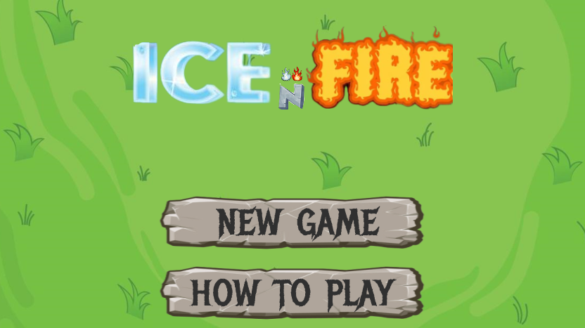

# Ice N Fire

Welcome to Ice N Fire, a captivating multiplayer game developed using Python and the Pygame library. This game showcases my game design and programming skills through custom animations, an intuitive user input system, and an object-oriented approach. Experience the thrill of strategic gameplay, where choosing between ice and fire powers determines your fate.



## Key Features

- **Game Development**: Developed using Python and Pygame, highlighting game design and programming skills.
- **Custom Animations**: Designed and implemented animations to enhance visual appeal and interactivity.
- **User Input System**: Intuitive input system for smoother and engaging interactions.
- **Object-Oriented Approach**: Utilized principles like inheritance and encapsulation for seamless gameplay and code organization.
- **Creative Problem-Solving**: Overcame Pygame limitations, showcasing creative technical problem-solving.

## Game Rules

### Players and Powers

- **Multiplayer**: 2 to 6 players.
- **Choose Powers**: 
  - Ice Power: Initial health -10
  - Fire Power: Initial health 10
- **Health Range**: Between -10 and 10.

### Gameplay Mechanics

- **Rolling the Die**: Players roll a die to get a number.
- **Actions**: With the number rolled, players can either:
  - Attack another player.
  - Heal themselves (health cannot exceed max health of 10).
- **Health Dynamics**: 
  - Attacks move the target's health towards 0.
  - If health reaches 0, the player dies and loses the game.
  - Attacks are 1.5 times more effective against players with a different power (rounded down).
  
### Example

- Player 1 (Ice) rolls a 4 and attacks Player 2 (Fire):
  - Damage: 4 * 1.5 = 6.
- Player 1 (Ice) rolls a 5 and attacks Player 2 (Fire):
  - Damage: 5 * 1.5 = 7 (7.5 rounded down).

### Power Switching

- If attack damage exceeds the target's health, the target switches power and the remaining damage is applied as health.
- **Example**: 
  - Player 1 (Ice) has health -3.
  - Player 2 (Ice) has health -5, rolls 4, and attacks Player 1.
  - Player 1 switches to Fire with health 1.

### Winning the Game

- The last player alive wins.

## Technologies Used

- **Python**: Core programming language.
- **Pygame**: Library for game development.

## Getting Started

Follow these steps to set up Ice N Fire on your local machine.

### Prerequisites

- Python (v3.x)
- Pygame

### Installation

1. Clone the repository:
    ```bash
    git clone https://github.com/KoustubhSahu/ice_N_fire.git
    ```
2. Navigate to the project directory:
    ```bash
    cd ice_N_fire
    ```
3. Install Pygame:
    ```bash
    pip install pygame
    ```
4. Run the game:
    ```bash
    python main.py
    ```

## Usage

- **Starting the Game**: Run `main.py` to start the game.
- **Choosing Powers**: Each player selects either ice or fire power.
- **Rolling the Die**: Players take turns rolling the die to attack or heal.
- **Strategic Attacks**: Plan your attacks based on the opponent's power for maximum damage.

## Contributing

Contributions are welcome! If you have suggestions or improvements, please create an issue or submit a pull request.

1. Fork the repository.
2. Create your feature branch:
    ```bash
    git checkout -b feature/AmazingFeature
    ```
3. Commit your changes:
    ```bash
    git commit -m 'Add some AmazingFeature'
    ```
4. Push to the branch:
    ```bash
    git push origin feature/AmazingFeature
    ```
5. Open a pull request.

## License

This project is licensed under the Creative Commons Attribution-NonCommercial 4.0 International License. See the [LICENSE](LICENSE) file for details.


## Contact

Feel free to reach out with any questions or feedback:
- GitHub: [KoustubhSahu](https://github.com/KoustubhSahu)

---

Thank you for playing Ice N Fire! May the best power prevail!
